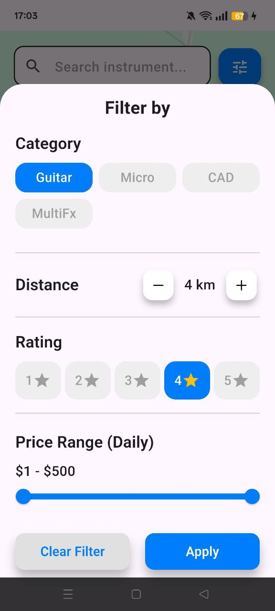
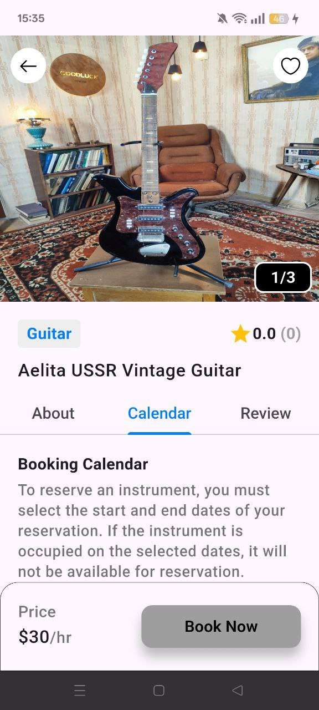
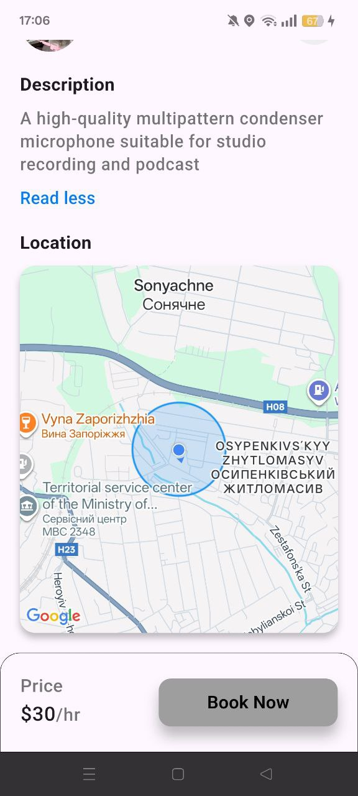
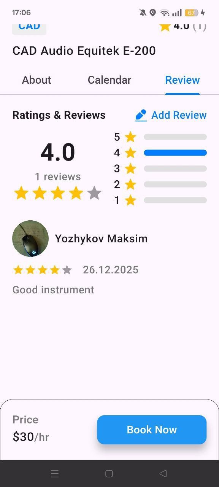
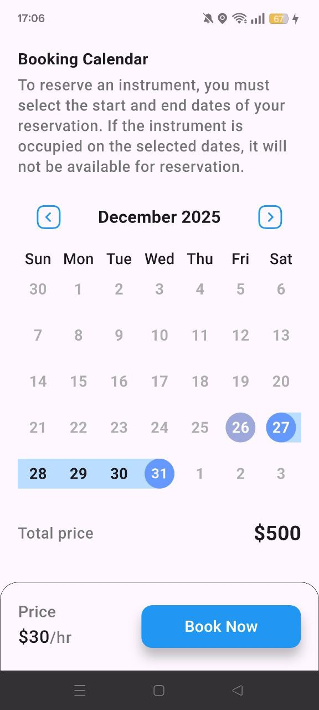
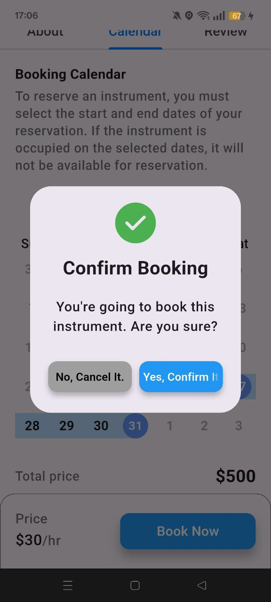
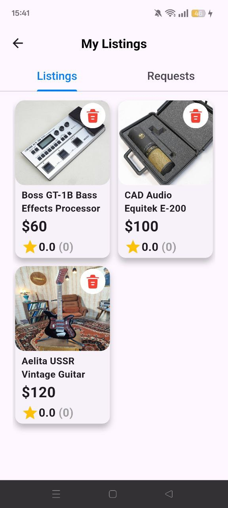
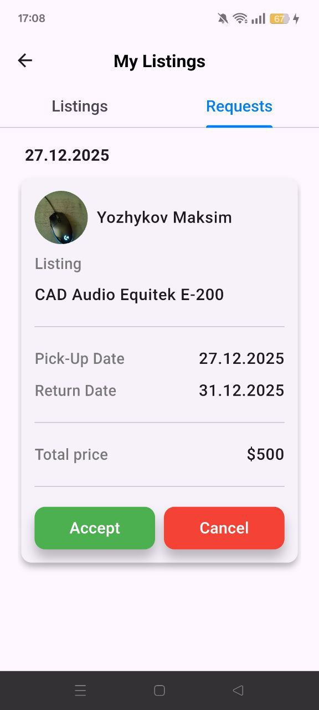
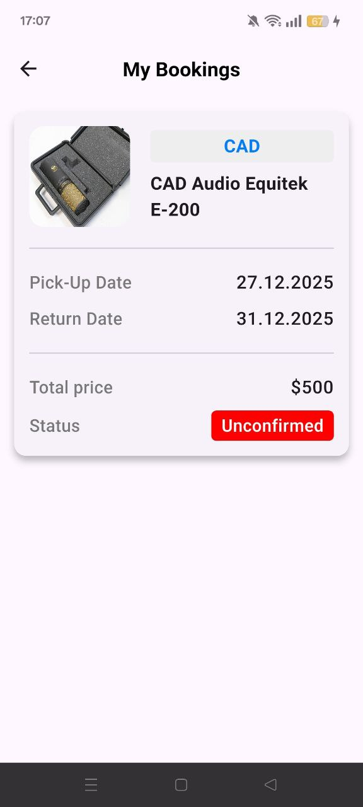
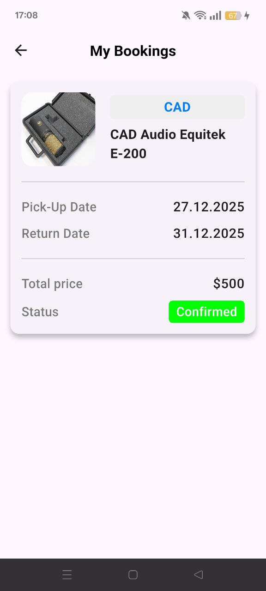

<div align="center">

# 🎸 InstrumentRental Mobile App

**Peer-to-Peer Marketplace for Musical Instruments & Equipment** 

</div>

## 📄 About

InstrumentRental is a mobile app that solves the "equipment is too far away" problem for musicians and event organizers. Our interactive map with customizable radius filtering shows only instruments within your reach, updated in real-time. Users can list idle gear for local rentals or book nearby equipment with one-tap confirmation.

## ✨ Features

- 🔐 **Authentication** – Sign up, login, password reset  
- 📦 **Listings** – Add/edit/delete equipment with photos & prices  
- 🔍 **Search** – Find equipment by title or category  
- 🎯 **Filters** – Filter by category, price range, minimum average rating, distance radius  
- 📅 **Availability Calendar** – Visual booking calendar per listing  
- ✅ **Booking System** – Reserve equipment for specific dates  
- ⭐ **Reviews & Ratings** – Rate instruments and owners  
- 📞 **Contact** – Get owner's phone number  
- 📍 **Interactive Map** – Dynamic loading on pan/zoom (Airbnb-style), shows user location  
- 🎨 **UI/UX** – Light/dark theme, multi-language support  
- 💖 **Favorites** – Save and manage favorite listings

## 🛠 Tech Stack

**Core Framework**
- **Flutter** – Cross-platform UI framework  
- **Dart** – Programming language

**State Management**
- **BLoC**
- **Cubit**

**Dependency Injection**
- **GetIt** – Service locator and dependency injection

**Backend & Cloud Services**
- **Firebase**
  - **Firebase Auth** – User authentication
  - **Cloud Firestore** – Real-time NoSQL database
- **Supabase** – File storage for photo instruments and user's avatar

**Navigation**
- **GoRouter** – Navigation and routing

**Maps & Geolocation**
- **Google Maps Flutter** – Interactive maps
- **Geolocator** – Location services
- **Permission Handler** – Permission management

**UI Components**
- **Table Calendar** – Calendar widget for booking
- **Flutter Rating Bar** – Star rating bar
- **Grouped List** – Sectioned list views
- **Iconsax** – Modern icon pack
- **Another Flutter Splash Screen** – Custom splash screen

**Media & Storage**
- **Image Picker** – Image selection from gallery
- **Shared Preferences** – Local data persistence (theme, language settings)

**Utilities**
- **UUID** – Unique ID generation

## 🚀 Getting Started

### Prerequisites
- Flutter SDK (>= 3.x)
- Dart
- Android Studio or VS Code
- Android emulator or physical Android device

### Installation
1. Clone the repository
```
git clone https://github.com/yozhykovanatolii/MarketplaceMusicalInstrumentsApp.git
```

2. Install dependencies
```
flutter pub get
```
3. Run the application
```
flutter run
```

## 📸 Screenshots
<details>
<summary>🔍 <strong>Search & Filter</strong></summary>
<div align="center">


<br>
Interactive Map • Advanced Filters
</div>
</details>

<details>
<summary>📋 <strong>Listing Details</strong></summary>
<div align="center">



<br>
Listing Detail • About Tab • Reviews Tab
</div>
</details>

<details>
<summary>📅 <strong>Booking Flow</strong></summary>
<div align="center">


<br>
Availability Calendar • Booking Confirmation
</div>
</details>

<details>
<summary>👤 <strong>Account Management</strong></summary>
<div align="center">




<br>
My Listings • Incoming Requests • Pending Bookings • Confirmed Bookings
</div>
</details>

